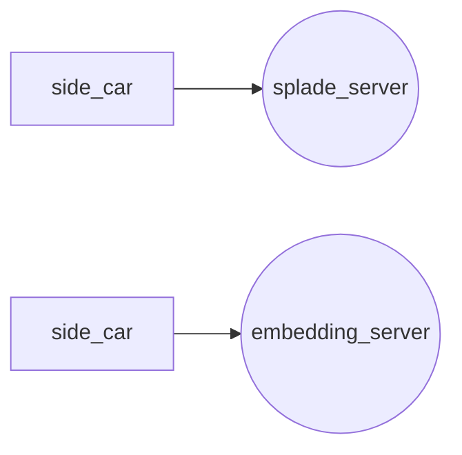

# hi

This is meant to test the performance of embedding servers
Using terraform only for the purpose of reproducability.

## Testing Setup

Create a markdown graph


## Setup terraform

Download terraform cli
Download aws cli

run `aws configure` You will see a prompt similar to this

```
user@machine $ aws configure
AWS Access Key ID [****************PYVK]: ****PYVK
AWS Secret Access Key [****************duMt]: ****duMt
Default region name [eu-central-1]: 
Default output format [None]: 

user@machine $
```

To get the ACCESS KEY and SECRET KEY you must create a user, give that user
admin perms and request for an access key for cli usage. The begining of this
guide here worked for me. https://spacelift.io/blog/terraform-tutorial

## Reproduce tests

```sh
terraform init
cp <your-ssh-pub-key-location> ./ssh-key.pub
terraform apply
```

You should see this as your output

```
side_car_ip = "<your-side_car-ip>"
splade_ip = "<your-splade-server-ip>"
```

Set up for splade_server
```sh

ssh dev@<your-side_car-ip>

apt-get install python3.9 python3-is-python python-venv

git clone https://github.com/arguflow/embedding-performance
cd embedding-performance
python3 -m venv venv
. venv/bin/activate
pip install -r requirements.txt
granian embeddings:app --interface asgi --host 0.0.0.0 --port 7070
```

The side_car_ip is what we will test from

Set up for side_car
```sh
ssh dev@<your-side_car-ip>

sudo apt-get update -y && sudo apt-get install -y luajit
git clone https://github.com/wg/wrk
git clone https://github.com/arguflow/embedding-performance
cd wrk; make
cd ../embedding-performance/

./test.sh <your-splade-server-ip>:7070
./test.sh <your-embedding-server-ip>:7070
```

To change the machine type
```sh
update the server-machine-type in main.tf
```

To bring down all servers 

```sh
terraform destroy
```
